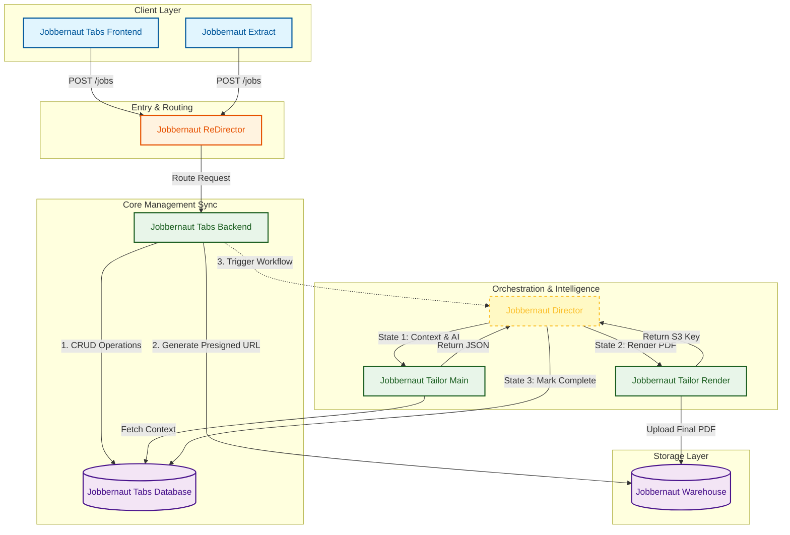

# Jobbernaut Ecosystem v1.0 Alpha - Proposed System Architecture

---

# Jobbernaut Ecosystem v1.0 Alpha - Stack Definition

| Component Name | Role | Technology Stack |
| :--- | :--- | :--- |
| **Jobbernaut Tabs Frontend** | User Interface (Web) | **Next.js** (React), Tailwind CSS. Hosted on Vercel or AWS S3 + CloudFront. |
| **Jobbernaut Extract** | Data Collection | **Chrome Extension** (Manifest V3), Vanilla JS / React. |
| **Jobbernaut ReDirector** | API Gateway | **AWS API Gateway** (HTTP API). Routes traffic and handles CORS. |
| **Jobbernaut Tabs Backend** | Core Logic (Sync) | **AWS Lambda** (Python 3.12). Handles CRUD, Validation, and Presigned URLs. |
| **Jobbernaut Tabs Database** | Data Persistence | **AWS DynamoDB** (On-Demand). Single-table design for Jobs and Users. |
| **Jobbernaut Warehouse** | File Storage | **AWS S3** (Standard). Stores Resumes, Cover Letters, and Source PDFs. |
| **Jobbernaut Director** | Orchestration | **AWS Step Functions**. Manages the async workflow state and retries. |
| **Jobbernaut Tailor Main** | Intelligence Microservice | **AWS Lambda** (Docker Image). Python 3.12, **LangGraph**, OpenAI API. |
| **Jobbernaut Tailor Render** | Render Microservice | **AWS Lambda** (Docker Image). Python 3.12, **TeXLive** (LaTeX), Jinja2. |
